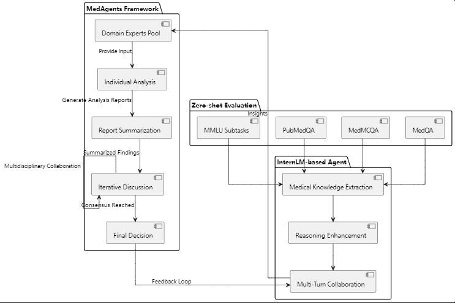

# LLM4Med 项目


## 项目简介

大型语言模型（LLMs），尽管在各类通用领域取得了显著进展，但在医学和医疗保健领域仍面临重大障碍。该领域具有独特的挑战，如领域特定术语和基于专业知识的推理。为了解决这些问题，我们提出了 MedAgents，一个针对医疗领域的新型多学科协作框架。MedAgents 在角色扮演的环境中利用基于 InternLM 的代理，参与协作性的多轮讨论，从而提升 InternLM 的能力和推理能力。这个无需训练的框架包含五个关键步骤：汇集领域专家，提出个体分析，总结这些分析成报告，迭代讨论直到达成共识，最终做出决策。我们的工作聚焦于零样本设置，这在现实世界场景中具有广泛应用。九个数据集（MedQA、MedMCQA、PubMedQA 及 MMLU 的六个子任务）的实验结果表明，我们提出的 MedAgents 框架在挖掘和利用 InternLM 中的医学专业知识以及扩展其推理能力方面表现出色。

## 项目架构




## 功能

- **临床决策支持**
- **医疗文档自动化**
- **患者互动（聊天机器人）**

## 安装与使用

```bash
git clone https://github.com/1106280506Hx/MedAgents.git
cd MedAgents
pip install -r requirements.txt
